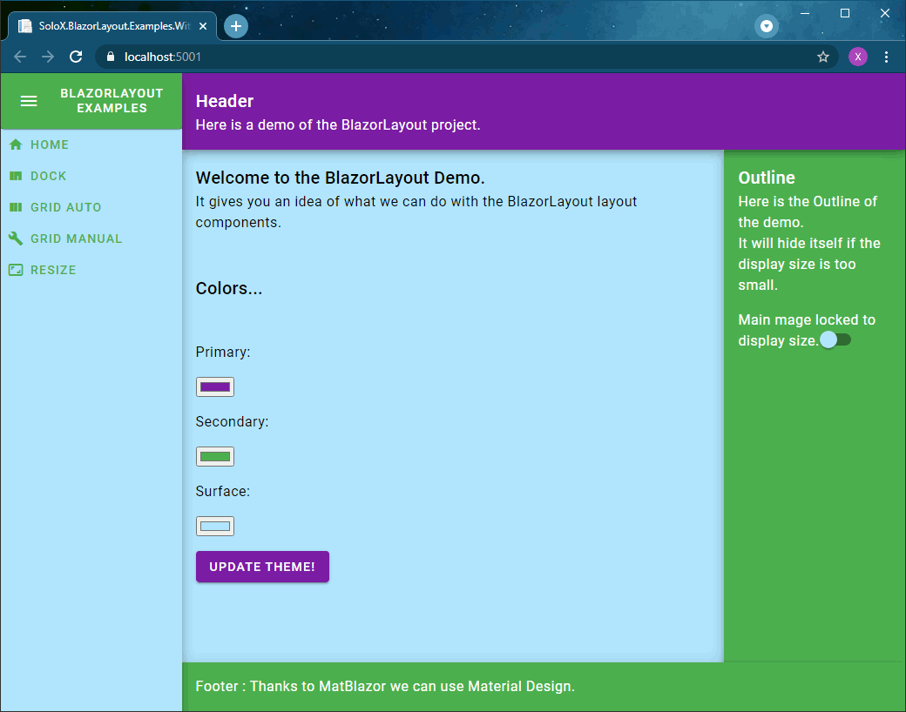

# BlazorLayout
The BlazorLayout project provides components to handle layout in your Blazor applications.

The BlazorLayout project provides Blazor components to help you to write your layout with
dedicated basic layout elements. Behind the scene it is generating standard HTML code so it can
easily be used in combination of other design system resources.

Behind the scene, it is making a massive use of CSS Grid.

The idea of this project is that with a set of simple layout components we can cover a big part of the needs.

Don't hesitate to post issues, pull requests on the project or to fork and improve the project.

## Project dashboard

[](https://github.com/xaviersolau/BlazorLayout/actions/workflows/build-ci.yml)
[](https://coveralls.io/github/xaviersolau/BlazorLayout?branch=main)
[](LICENSE)

| Package                                    | Nuget.org |
|--------------------------------------------|-----------|
|**SoloX.BlazorLayout**            |[](https://www.nuget.org/packages/SoloX.BlazorLayout)|

## License and credits

BlazorLayout project is written by Xavier Solau. It's licensed under the MIT license.

 * * *

## Installation

You can checkout this Github repository or you can use the NuGet packages:

**Install using the command line from the Package Manager:**
```bash
Install-Package SoloX.BlazorLayout -version 1.0.0-alpha.14
```

**Install using the .Net CLI:**
```bash
dotnet add package SoloX.BlazorLayout --version 1.0.0-alpha.14
```

**Install editing your project file (csproj):**
```xml
<PackageReference Include="SoloX.BlazorLayout" Version="1.0.0-alpha.14" />
```

Once the package is referenced, you can add in you project **_Imports.razor** file all using directives to
use the components.

```razor
@using SoloX.BlazorLayout.Core
@using SoloX.BlazorLayout.Containers
@using SoloX.BlazorLayout.Containers.Dock
@using SoloX.BlazorLayout.Containers.Grid
@using SoloX.BlazorLayout.Layouts
```

Make sure that your application project CSS file defines the **box-sizing** property to **border-box**:

```css
* {
    box-sizing: border-box;
}
```

And you should also set width and height to 100% for the html and body elements:

```css
html, body {
    width: 100%;
    height: 100%;
}
```


## How to use it

Note that you can find code examples in this repository at this location: `src/examples`.

### The ResponsiveLayout component

The ResponsiveLayout component can be used in your MainLayout.razor file. It provides a responsive main
layout implementation with a navigation menu, header, footer and outline view.

Here is a screen from one of the repository example:



The component is designed with several parameters:

| Parameter                                      | Description |
|------------------------------------------------|-------------|
| NavigationHeader (RenderFragment)              | Navigation menu Header |
| NavigationMenu (RenderFragment)                | Navigation menu (HTML ul and li element should be used as children) |
| SmallNavigationHeader (RenderFragment)         | Navigation menu Header (Small version) |
| SmallNavigationMenu (RenderFragment)           | Navigation menu (Small version) |
| Header (RenderFragment)                        | Main layout Header |
| Footer (RenderFragment)                        | Main layout Footer |
| Outline (RenderFragment)                       | Outline view |
| ChildContent (RenderFragment)                  | Main layout Body |
| UseSmallNavigation  (bool)                     | Force use of small navigation view |
| EnableOutline (bool)                           | Enable/Disable outline view |
| EnableContentScroll (bool)                     | Change scrolling behavior to force main layout view to fit the display view and to enable scrolling in the child view |
| DisableHorizontalNavigationMenuScrollX (bool)  | Disable scroll on horizontal navigation menu and wrap content |
| HideHeader (bool)                              | Hide header panel |
| HideFooter (bool)                              | Hide footer panel |

The small navigation view is used depending on the size of the display view.

Some cascading parameter are available in the child component of the ResponsiveLayout:

| CascadingParameter       | Description |
|--------------------------|-------------|
| ScreenSize (ScreenSize)  | [The screen size](src\libs\SoloX.BlazorLayout\Layouts\ScreenSize.cs) |
| ScrollInfo (ScrollInfo)  | [The main screen scroll info](src\libs\SoloX.BlazorLayout\Core\ScrollInfo.cs) |


### Base layout components

#### The containers

All containers are based on a `AContainer` abstract component that provides a `Fill` parameter. It allows you
to define how the component is going to be sized:

- **None**: Sized to fit its own content;
- **Horizontal**: Sized to fill its parent space horizontally;
- **Vertical**: Sized to fill its parent space vertically;
- **Full**: Sized to fill its parent space both vertically and horizontally;

Here is the list of available containers:

| Component                              | Description               |
|----------------------------------------|---------------------------|
| BoxContainer      | A simple container that stack child elements vertically.    |
| InlineContainer   | A simple container that stack child elements horizontally.    |
| ResizeContainer   | A re-sizable container.    |
| ResizeContainer   | A re-sizable container.    |
| DockContainer   | A container that can dock a panel on a given side.    |
| GridContainer   | A container that place its child cells along the grid definition.    |

#### The panels

All panels are based on a `APanel` abstract component that provides a set of parameters like Class, Style,
Id that are basically mapped to the corresponding HTML element attributes.

> Note that all container are also based on `APanel` abstract component.

Full list of `APanel` parameters:

- **Class**: The HTML element `class` attribute;
- **Style**: The HTML element `style` attribute;
- **Id**: The HTML element `id` attribute;
- **ChildContent**: The panel child `RenderFragment`;

The `APanel` also provides a ElementReference property that is referencing the HTML element associated to
 the panel instance once initialized and rendered.

Here is the list of available panels:

| Panel                              | Description               |
|----------------------------------------|---------------------------|
| DockPanel      | A simple container that stack child elements vertically.    |
| GridCell   | A simple container that stack child elements horizontally.    |

### The services

#### Set up
In order to use the BlazorLayout services in your application, you have to register the services in your Startup.cs file or your Program.cs.
A ServiceCollection extension method is available for that purpose:

```csharp
using SoloX.BlazorLayout;

// ...

// Service collection setup method.
public void ConfigureServices(IServiceCollection services)
{
    services.AddBlazorLayout();
}
```

#### The resize observer service

Let's say that you need to follow the size changed event of a component in your page. The project provides
 you with some help to setup such observer: the `IResizeObserverService`.

You can inject the `IResizeObserverService` in your components.

For example we can define a ResizeCallback page that will register a resize callback with a `BoxContainer`:

```razor
@page "/ResizeCallback"

@inject IResizeObserverService sizeObserverService

@implements IResizeCallback

@implements IAsyncDisposable

<BoxContainer @ref="ContainerReference" Fill="Fill.Full">
    @* ... *@
</BoxContainer>
```

Note that:
- We use `@ref` in order to get a reference on the component instance.
- We implement `IResizeCallback` in order to use this as callback in the `IResizeObserverService`.
- We implement `IAsyncDisposable` in order to dispose callback resources.

Here is the C# part of the component:

```csharp
    // The BoxContainer reference used in the @ref property.
    private BoxContainer ContainerReference { get; set; }

    // The call back disposable returned by the callback registration.
    private IAsyncDisposable callbackDisposable;

    protected override async Task OnAfterRenderAsync(bool firstRender)
    {
        if (firstRender)
        {
            // Register the callback to the IResizeObserverService once the ContainerReference is set
            // after the first render.
            // Note that it returns a disposable callback object that must be disposed to properly
            // unregister the service resources.
            callbackDisposable = await sizeObserverService
                .RegisterResizeCallbackAsync(this, ContainerReference.ElementReference);
        }

        await base.OnAfterRenderAsync(firstRender);
    }

    // Implement the IResizeCallback interface.
    public ValueTask ResizeAsync(int width, int height)
    {
        // Callback code....

        return ValueTask.CompletedTask;
    }

    // Dispose the callback resources.
    public async ValueTask DisposeAsync()
    {
        await callbackDisposable.DisposeAsync();
    }
```

#### The scroll observer service

Now we are going to follow the scroll changed event of a component in your page. The project provides
 you with some help to setup such observer: the `IScrollObserverService`.

You can inject the `IScrollObserverService` in your components.

For example we can define a ScrollCallback page that will register a scroll callback with a `BoxContainer`:

```razor
@page "/ScrollCallback"

@inject IScrollObserverService scrollObserverService

@implements IScrollCallback

@implements IAsyncDisposable

<BoxContainer @ref="ContainerReference" Fill="Fill.Full">
    @* ... *@
</BoxContainer>
```

Note that:
- We use `@ref` in order to get a reference on the component instance.
- We implement `IScrollCallback` in order to use this as callback in the `IScrollObserverService`.
- We implement `IAsyncDisposable` in order to dispose callback resources.

Here is the C# part of the component:

```csharp
    // The BoxContainer reference used in the @ref property.
    private BoxContainer ContainerReference { get; set; }

    // The call back disposable returned by the callback registration.
    private IAsyncDisposable callbackDisposable;

    protected override async Task OnAfterRenderAsync(bool firstRender)
    {
        if (firstRender)
        {
            // Register the callback to the IScrollObserverService once the ContainerReference is set
            // after the first render.
            // Note that it returns a disposable callback object that must be disposed to properly
            // unregister the service resources.
            callbackDisposable = await scrollObserverService
                .RegisterScrollCallbackAsync(this, ContainerReference.ElementReference);
        }

        await base.OnAfterRenderAsync(firstRender);
    }

    // Implement the IResizeCallback interface.
    public ValueTask ScrollAsync(ScrollInfo scrollInfo)
    {
        // Callback code....

        return ValueTask.CompletedTask;
    }

    // Dispose the callback resources.
    public async ValueTask DisposeAsync()
    {
        await callbackDisposable.DisposeAsync();
    }
```

#### The ResponsiveLayout service

The `IResponsiveLayoutService` is provided to allow you to dynamically hide the header or the footer panel.

For exemple you can inject the service in your component:

```csharp
[Inject]
public IResponsiveLayoutService ResponsiveLayoutService { get; set; }
```

And you can hide or show the header in your scroll call back method:

```csharp
public ValueTask ScrollAsync(ScrollInfo scrollInfo)
{
    ResponsiveLayoutService.HideHeader(scrollInfo.Top > 0);

    return ValueTask.CompletedTask;
}
```

Note that you should restore the Hide header/footer when your page is destroyed:

```csharp
public async ValueTask DisposeAsync()
{
    ResponsiveLayoutService.HideHeader(false);
}
```
